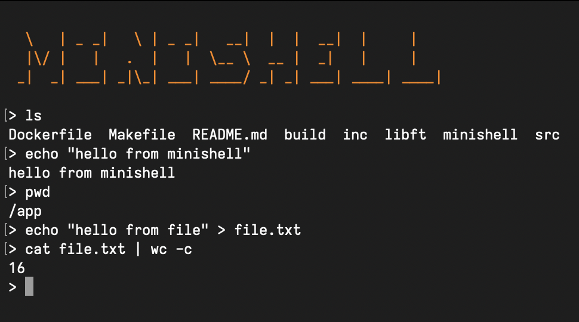

*This project has been created as part of the 42 curriculum in collaboration with [Dante Uccello](https://github.com/duccello)*



## Description
Simplified shell that replicates many fundamental behaviours of **Bash**.

It uses the [GNU readline](https://www.man7.org/linux/man-pages/man3/readline.3.html) API for input handling.

To avoid platform-specific issues, the project uses a Docker container installed with Ubuntu and GNU readline.

*Note: some functions of the readline API leak memory, these leaks are not explicitly cleaned in this project.*

## How to run

*Note: to run this project you need to have [Docker](https://www.docker.com/) installed. You can find the installation guide [here](https://docs.docker.com/desktop/?_gl=1*19toit*_gcl_au*MTYyMDUxNDMyNC4xNzcwMDIzNTk3*_ga*NTM5NTMzMTIwLjE3NzAwMjM1OTg.*_ga_XJWPQMJYHQ*czE3NzA4MDE0ODUkbzQkZzEkdDE3NzA4MDE0ODYkajU5JGwwJGgw).*

Clone this repository via the web URL:

```bash
https://github.com/simone-gasparini-94/minishell.git
```
Change to the project directory:

```bash
cd minishell
```

Build the Docker image:

```bash
docker build -t minishell .
```

Run the container in interactive mode:
```bash
docker run -it minishell
```

Compile the static library:
```bash
cd libft && make && cd ..
```

Compile the program:
```bash
make
```

Run the program:
```
./minishell
```


## Features
- Built-in commands:
	- `echo`, `cd`, `pwd`, `export`, `unset`, `env`, `exit`
- External commands
- `'` (single quotes) and `"` (double quotes)
- Redirections (`<`, `>`, `<<`, `>>`)
- Pipes (`|`)
- Environment variables (`$HOME`, etc.)
- Exit status tracking (`$?`)
- Signals (`Ctrl-C`, `Ctrl-D`, and `Ctrl-\`)
